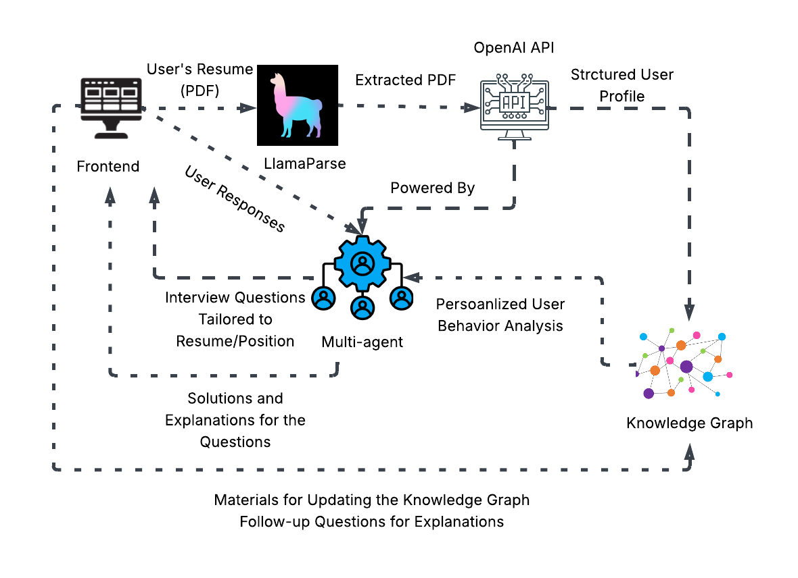

# Jobify — AI-Powered Interview Coach

[](LICENSE)
[](#team)

Proudly created by **Jobify**.

---

## Getting Started

Below is the minimal set of third‑party tools, libraries, SDKs and cloud services that Jobify depends on directly.

### 🖥️ Front-End Dependencies

| Library/Tool  | Purpose                                          | Link                                                                                   |
| ------------- | ------------------------------------------------ | -------------------------------------------------------------------------------------- |
| React.js      | UI framework for building interactive interfaces | [reactjs.org](https://reactjs.org/)                                                    |
| Quill         | Rich text editor for user input                  | [quilljs.com](https://quilljs.com/)                                                    |
| Video.js      | HTML5 video player                               | [videojs.com](https://videojs.com/)                                                    |
| AWS S3 JS SDK | Upload and retrieve videos from AWS S3           | [docs.aws.amazon.com](https://docs.aws.amazon.com/AWSJavaScriptSDK/latest/AWS/S3.html) |
| Countdown.js  | Countdown timer for interviews                   | [GitHub - hilios/jQuery.countdown](https://github.com/hilios/jQuery.countdown)         |
| Bootstrap     | UI component library for layouts and styling     | [getbootstrap.com](https://getbootstrap.com/)                                          |
| Tailwind CSS  | Utility-first CSS framework for custom styling   | [tailwindcss.com](https://tailwindcss.com/)                                            |

---

### 🧠 Back-End Dependencies

| Library/Tool  | Purpose                                          | Link                                                                                                                                                                                                                                                  |
| ------------- | ------------------------------------------------ | ----------------------------------------------------------------------------------------------------------------------------------------------------------------------------------------------------------------------------------------------------- |
| LlamaParse    | Process PDF files                                | [llamaindex.ai/llamaparse](https://www.llamaindex.ai/llamaparse?gad_source=1&gad_campaignid=21116317807&gbraid=0AAAAA9du_J0CkmThGan_q1frhfR59JbAE&gclid=Cj0KCQjwyIPDBhDBARIsAHJyyVjUe6Zg1Wtgn6OlPtRq2REI2zOr368RSxqPsimjxi_sFbUiBKNWaWwaAr_AEALw_wcB) |
| OpenAI API    | Extract keywords and form questions              | [platform.openai.com](https://platform.openai.com/docs/)                                                                                                                                                                                              |
| spaCy         | NLP toolkit in Python                            | [spacy.io](https://spacy.io/)                                                                                                                                                                                                                         |
| LanguageTool  | Grammar and style checking                       | [languagetool.org](https://languagetool.org/)                                                                                                                                                                                                         |
| Neo4j         | Graph database for knowledge representation      | [neo4j.com](https://neo4j.com/)                                                                                                                                                                                                                       |
| Express.js    | Minimal backend framework for Node.js            | [expressjs.com](https://expressjs.com/)                                                                                                                                                                                                               |
| AWS Boto3 SDK | Python SDK for accessing AWS services (e.g., S3) | [boto3.amazonaws.com](https://boto3.amazonaws.com/v1/documentation/api/latest/index.html)                                                                                                                                                             |
| FFmpeg        | Video/audio processing for recordings            | [ffmpeg.org](https://ffmpeg.org/)                                                                                                                                                                                                                     |

---

### 🧰 Infrastructure & Data Storage

| Library/Tool | Purpose                 | Link                                          |
| ------------ | ----------------------- | --------------------------------------------- |
| PostgreSQL   | Relational database     | [postgresql.org](https://www.postgresql.org/) |
| MongoDB      | NoSQL document database | [mongodb.com](https://www.mongodb.com/)       |

---

## Model and Engine

### Story Map


### Engine Architecture


**1. 🖥️ Frontend**

The function of the frontend is for users to upload files and answer questions, and showing solutions and explanations. It uses frameworks like React or Vue to integrate file input, rich text editing, and video recording using browser-native APIs. Then the uploaded files are furthur processed.

**2. 🦙 LlamaParse**

LlamaParse is a third-party tool used to extract information from PDF files. It processes user resumes and extracts key information. The parsed data is returned in a machine-readable format (e.g., JSON) and serves as the input to the OpenAI API for profile generation.

**3. 🤖 OpenAI API**

The OpenAI API is used to analyze the resume data and convert it into a structured user profile, which includes skills, ideal job roles, knowledge gaps, and areas of expertise. The OpenAI API is also responsible for generating questions. All NLP functionality is powered by this API.

**4. ⚙️ Multi-Agent**

The multi-agent system coordinates various AI agents, each responsible for a specific task such as resume understanding, question generation, knowledge graph searching, and follow-up generation. Built using frameworks like LangChain, it is able to generate resume/position tailored interview questions and answers/explanations to the questions.

**5. 🕸️ Knowledge Graph**

The knowledge graph obtains information from uploaded files and stores all known questions, concepts, user profiles, and answers in a structured graph database like Neo4j. It enables relationship-based querying and helps the system maintain consistency.

---

## APIs and Controller

**1. POST /upload-resume**

It accepts users' resumes in PDF files and sends them to LlamaParse for structured content extraction. It returns JSON representation of the parsed resume.

**2. POST /submit-answer**

It submits users' answer (text or video) to a specific question. It stores the response and evaluates it using OpenAI. It returns evaluation result and correct answers with explanations.

**3. POST /update-knowledge-graph**

It adds new nodes (concepts, questions, answers) to the Neo4j knowledge graph. It returns an update confirmation.

<!--
The **REST + WebSocket surface** defines how the React front‑end communicates with the engine.

### 1. `POST /v1/session`

| Key              | In   | Type   | Description                      |
| ---------------- | ---- | ------ | -------------------------------- |
| `candidate_name` | JSON | string | Display name to show in coach UI |

**Returns**

```json
{
  "session_id": "bf52…",
  "ws_url": "wss://api.genview.ai/v1/stream/bf52…"
}
```

### 2. `WS /v1/stream/{session_id}`

Bidirectional messages in the following frames:

| Event          | Direction       | Payload                                  | Notes                         |
| -------------- | --------------- | ---------------------------------------- | ----------------------------- |
| `user_audio`   | ↑ client→server | Binary Ogg chunks                        | 64 kbit/s Opus, 500 ms frames |
| `agent_text`   | ↓ server→client | `{ "text": "...", "utterance_id": 42 }`  | Interviewer speaks via TTS    |
| `score_update` | ↓               | `{ "fluency":0.84,"confidence":0.72,… }` | Real‑time gauges              |

*All messages are acknowledged with `{ "ack": <event_id> }`.*

### 3. `GET /v1/report/{session_id}`

Returns the final PDF plus a machine‑readable JSON companion.

| Code            | Description       |
| --------------- | ----------------- |
| `200 OK`        | `application/pdf` |
| `404 Not Found` | Unknown session   |

> **Controller layer** uses FastAPI dependency‑injection to route calls to `engine/*` modules, each of which is a façade over the subsystems shown in the block‑diagram.

*If you later decide to off‑load part of the engine (e.g., ASR) to an external SaaS, replace the corresponding internal block by an SDK/wrapper and keep the API contract unchanged.*-->

---

## View UI/UX

<!-- TODO: Fill in wire‑frames, component library decisions, user journeys in HW‑3. -->

---

## Team Roster

| Member           | Contribution<sup>†</sup> |
| ---------------- | ------------------------ |
| **Zhitong Tang** |                          |
| **Minjia Tang**  |                          |
| **Yile Sun**     |                          |
| **Zhenjie Sun**  |                          |
| **Houcheng Yu**  |                          |

<sup>†</sup> Detailed contribution statements will be completed at project close‑out.

_© 2025 GenView Team. Licensed under the MIT License._
